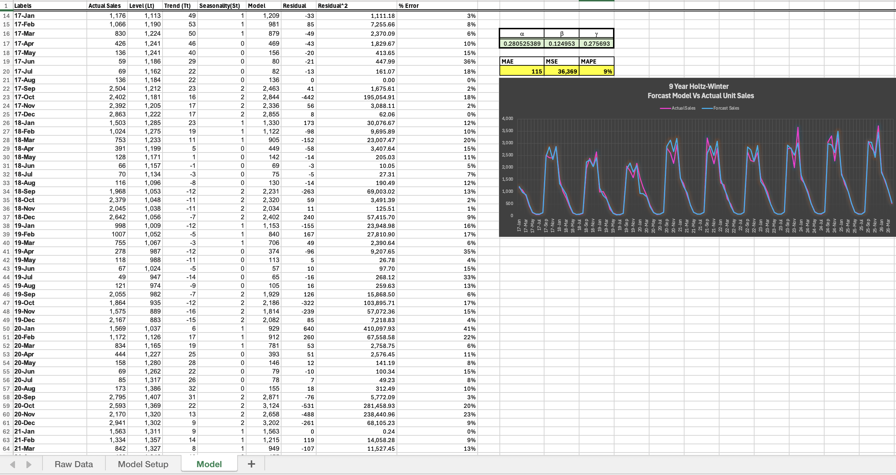
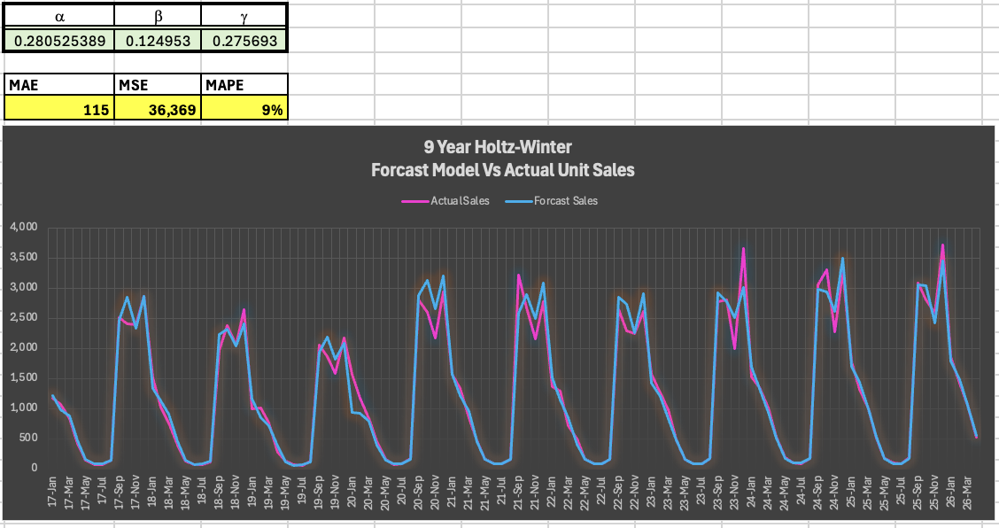
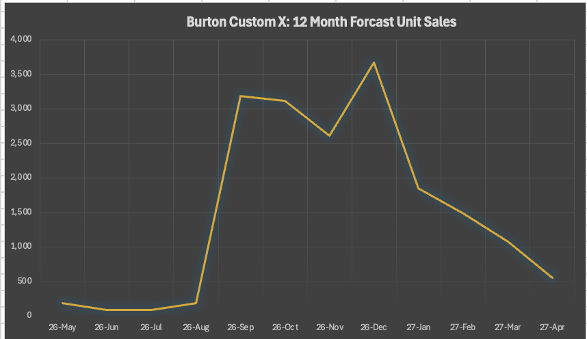

# Burton Custom X Snowboard Sales Forecasting Model

**Domain:** Time Series Analysis | Multiplicative Holt-Winters | Inventory Demand Planning  
**Tools & Frameworks:** Excel Solver, Holt-Winters Exponential Smoothing, Error Metrics (MAPE, MAE, MSE)

> **Executive Impact:** Developed a 9-year multiplicative Holt-Winters forecasting model for Burton Custom X unit sales (2017–2026), achieving a **9% Mean Absolute Percentage Error (MAPE)** and reducing forecast variance across peak winter sales windows.

[📥 Download Original Excel Model (.xlsx)](https://github.com/evanjameswarren/evanjameswarren.github.io/raw/main/Time-Series%20Forcast/Burton%20Custom%20X%20Board%20Focasting.xlsx)

---

## 1. Operational Problem & Business Context
Retail demand for high-end winter sports equipment like the **Burton Custom X** exhibits severe multi-month seasonality. Sales remain near zero during late spring and summer months (May–July) before surging dramatically between September and December.

Without accurate forecasting:
* **Overestimating demand** leads to capital tied up in excess off-season inventory and steep holding costs.
* **Underestimating demand** causes stockouts during peak quarter-four retail demand, incurring lost revenue and brand dilution.

---

## 2. Mathematical Methodology & Model Optimization

To capture both the underlying multi-year growth trend and intense intra-year seasonal spikes, a **Holt-Winters Multiplicative Exponential Smoothing** model was selected:

$$\hat{Y}_{t+h} = (L_t + h T_t) \cdot S_{t+h-m}$$

### Model Parameter Optimization
Smoothing parameters $(\alpha, \beta, \gamma)$ were optimized to minimize forecast error across historical monthly sales data (Jan 2017 – Mar 2026):

| Parameter | Symbol | Optimized Value | Function / Description |
| :--- | :---: | :---: | :--- |
| **Level Smoothing** | $\alpha$ | **`0.2805`** | Controls responsiveness to baseline demand shifts |
| **Trend Smoothing** | $\beta$ | **`0.1250`** | Smooths multi-year linear growth trajectory |
| **Seasonal Smoothing** | $\gamma$ | **`0.2757`** | Adjusts seasonal indices for Q4 demand peaks |

---

## 3. Visual Performance & Model Validation

### Full Excel Workbook Architecture & Residual Setup
The model dynamically computes level ($L_t$), trend ($T_t$), seasonal multipliers ($S_t$), residual error ($E_t$), and squared residual errors across every historical monthly observation.

### 9-Year Historical Fit vs. Actual Unit Sales (2017–2026)
The model closely tracks historical demand surges and troughs across 9 consecutive annual cycles, maintaining tight bounds even during peak 3,500+ unit demand months.

### 12-Month Out-of-Sample Unit Forecast (May 2026 – Apr 2027)
Projected unit demand for the upcoming fiscal cycle shows low summer baseline (~100 units/mo) ramping to a peak forecast of **3,678 units in December**.

---

## 4. Key Performance Metrics & Inventory Impact

### Model Accuracy Summary

| Metric | Symbol | Value | Interpretation |
| :--- | :---: | :---: | :--- |
| **Mean Absolute Percentage Error** | **MAPE** | **`9%`** | Excellent model fit (<10% industry standard for retail) |
| **Mean Absolute Error** | **MAE** | **`115`** | Average forecast deviation of 115 units / month |
| **Mean Squared Error** | **MSE** | **`36,369`** | Penalizes extreme outliers to ensure robust safety stock bounds |

### Operations & Supply Chain Takeaways
* **Safety Stock Optimization:** Lowering forecast uncertainty to 9% MAPE enables leaner safety stock buffers while maintaining a 95%+ service level target during peak December demand.
* **Procurement Lead-Times:** Production and purchasing commitments can be locked in during the low-demand May–July window based on reliable September ramp-up projections (~3,100 units).

---

> **Disclaimer & Data Notes:**  
> *This case study is an educational project developed for portfolio demonstration purposes. All product names, trademarks, and brand references (Burton Snowboards) belong to their respective owners and do not imply official endorsement or affiliation. The historical sales dataset used in this model is synthetic data generated via AI predictive modeling extrapolated from quarterly retail sales trends, with a 5% random noise factor applied to simulate real-world demand stochasticity.*

---

[← Back to Main Portfolio](../index.html)
